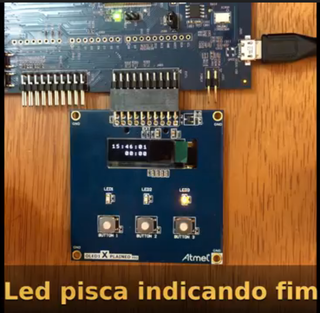

# 2020a - Avaliação prática 1

Nessa avaliação iremos trabalhar com o módulo OLED1 (botões/ LEDs e Display), o mesmo já está disponível no repositório da avaliação. 

- Atualize o arquivo `ALUNO.json` com seu nome e e-mail e faça um commit imediatamente.

>  Faça o seu trabalho de maneira ética!

- **A cada 30 minutos você deverá fazer um commit no seu código!**
    - Códigos que não tiverem commit a cada 30min ou que mudarem drasticamente entre os commits serão descartados (conceito I) !!
    - Você deve inserir mensagens condizentes nos commits!
- Duração: 3h

:triangular_flag_on_post: **Ao finalizar a entrega preencher o formulário (uma única vez!): https://forms.gle/uTa7SYNAPd2qbC8X7**

## Descrição

Nessa avaliação iremos trabalhar com o OLED1 e iremos desenvolver um 'cronometro' que poderia ser instalado em um eletrodoméstico (linha branca). O exemplo a seguir é um timer de um fogão.

Nessa avaliação vocês terão desenvolver um cronometro (contagem regressiva) com relógio, vocês devem utilizar o kit de desenvolvimento SAME70-XPLD mais display `OLED1`, o firmware deve possuir:

- Display:
    - `hh:mm:ss`: indicar a hora atual na primeira linha
    - `mm:ss`: indicar o valor do alarme (minutos e segundos) na segunda linha
- Botões:
    - `But1`: incrementar o valor do minuto do cronometro (max 59)
    - `But2`: incrementar o valor do segundo do cronometro (max 59)
    - `But3`: indicar o início (start) do alarme
- Leds:
    - `Led1`: Deve indicar se o alarme está ativado ou não
    - `Led3`: Ao final da contagem do alarme, deve piscar
    

## Rubricas

Vocês devem gravar um vídeo do firmware funcionando na placa para submeter o projeto.

### C

> Vídeo de como tem que ficar

Projeto funciona conforme descrição. Possui um pequeno bug (usando o protótipo possui algum erro), mas projeto funciona de forma geral. 

Usuário consegue ajustar valores do cronometro (**segundos**) e iniciar contagem regressiva, LCD mostra valores de hora e do cronometro (atualizado a cada segundo), LED1 indica que contagem está ativada. Ao final, LED3 pisca indicando final da contagem.

- [ ] LCD exibe hora: `hh:mm:ss` (atualizada a cada segundo)
- [ ] LCD exibe cronometro: `hh:mm:ss`
- [ ] Botões implementados e funcionando 
- [ ] Leds implementados e funcionando 
- [ ] Cronometro segundo implementando e funcionando
- [ ] Cronometro minutos implementando e funcionando
- [ ] É possível usar o cronometro mais de uma vez (configurar um novo cronometro ao término de um anterior)
- [ ] Usa TC para piscar LED quando alarme acaba contagem
- [ ] Usa RTC para armazenar hora
- [ ] Usa IRQ no TC, RTC e Botões
- [ ] Usa flags sempre (TC, RTC, botões)

> Exemplos de pequenos bugs
>
> - Iniciar cronometro com contador 00:00 faz valor ficar negativo
> - Contador segundo não fica no range entre 0 - 59
> - LED3 não para de piscar quando botão 3 é apertado
> - ....

:triangular_flag_on_post: **Ao finalizar a entrega preencher o formulário (uma única vez!): https://forms.gle/uTa7SYNAPd2qbC8X7**

### C+

- Sem bugs

### B

> Vídeo de como tem que ficar:

- Indica no LCD que cronometro está ativado
- Aumento 'inteligente' do valor de minuto e segundo do cronometro
    - Incrementa valor com o usuário segurando o botão.

### A

- Aumento `inteligente` é progressivo (acelerando conforme usuário segura botão pressionado)
- Animação no LCD indicando a contagem 

:triangular_flag_on_post:  **Ao finalizar a entrega preencher o formulário (uma única vez!): https://forms.gle/uTa7SYNAPd2qbC8X7**

### D

Um item:

- Não faz uso de IRQ (TC, RTC, PIO)
- LCD não mostra hora ou cronometro
- Botões não ajustam minuto ou segundo do contador
- Contagem não funciona 
- LED não pisca ao final da contagem
